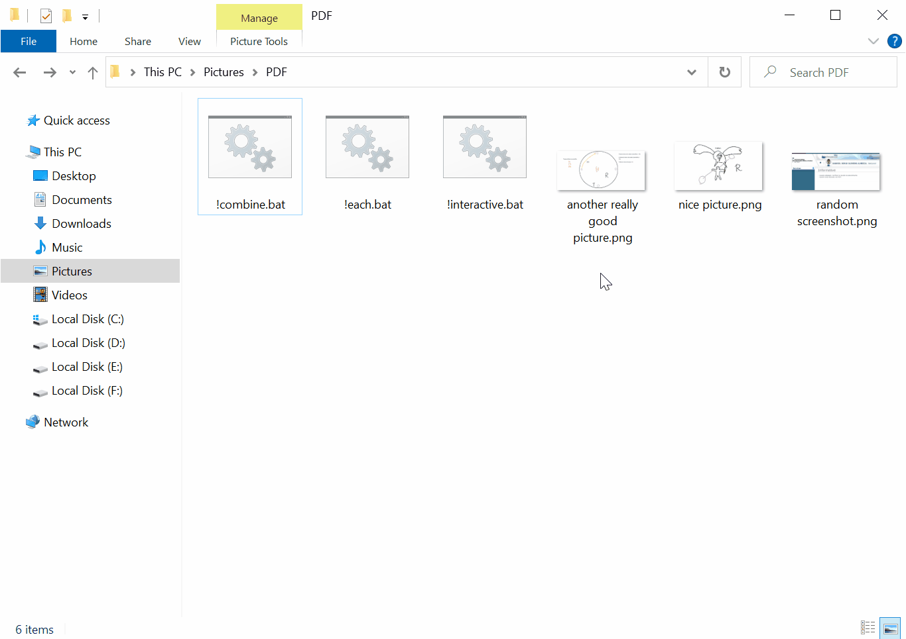
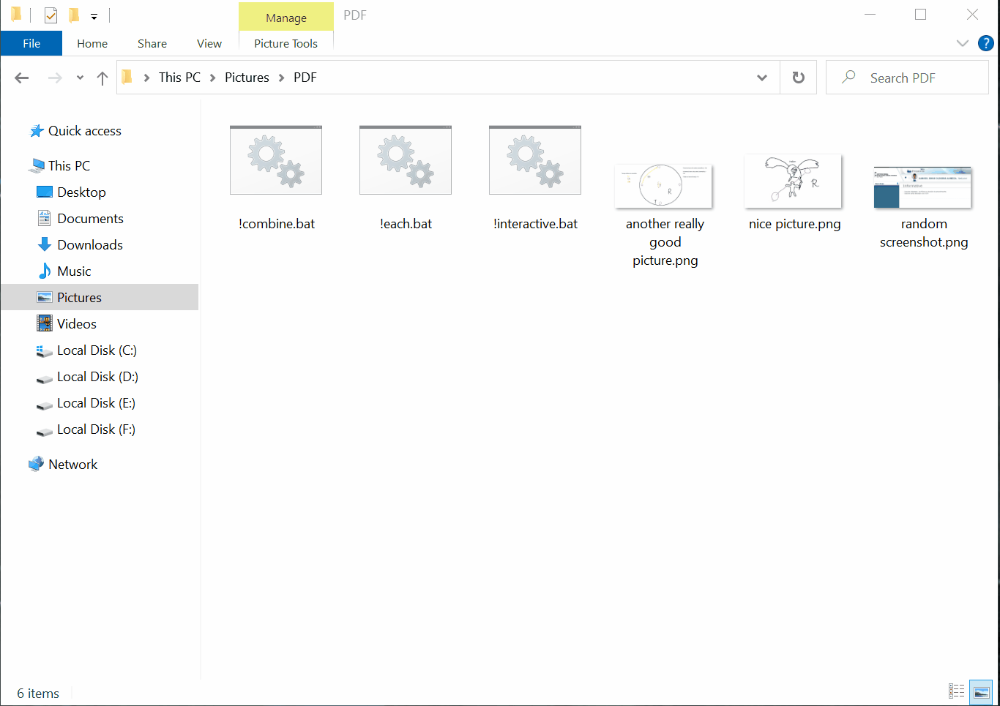

# ImageToPdf

ImageToPdf is a Kotlin CLI tool that allows you to convert images into PDF files with ease. The tool provides [`.bat` scripts](scripts) for convenient usage by enabling you to drag and drop images onto them. It offers various features to customize the PDF creation process, including support for converting images to JPG format with an optional quality factor, choosing between creating a single PDF or multiple PDFs when multiple files are provided, and automatically sorting inputted files based on different criteria.

## Features

- Create PDFs from a single or multiple images.
- Drag-and-drop support with the provided scripts.
- Create a single PDF with all images, or one PDF per image, at your choice.
- Optionally reduce PDF size by converting the images to `.jpg`. 
- Automatic sorting of inputted files based on different criteria, including name, name descending, created date, created date descending, modified date, and modified date descending.

## Download

Download the latest-compiled binary by clicking [HERE](https://github.com/SecretX33/ImageToPdf/releases/latest/download/ImageToPdf.jar).

This is a Java (JVM) project, so remember to install [Java 17](https://adoptium.net/temurin/releases/?version=17) to run it if you don't have it already.

## Quick Start

0. Install [Java](#Download) if you don't have it already.
1. Download the [app binary](https://github.com/SecretX33/ImageToPdf/releases/latest/download/ImageToPdf.jar).
2. Download all [scripts](scripts), they facilitate this app usage by **a lot**.
3. Open the downloaded scripts and replace `{{SET_THE_PATH_HERE}}` in both scripts by the actual folder where you saved the downloaded `ImageToPdf.jar` file.

Done!

To start creating PDFs, just drag-and-drop the images on the chosen script.

## Scripts

There's a brief explanation of _when_ to choose each script.

- [`!combine.bat`](scripts/!combine.bat): will create a single `.pdf` with all dragged images **COMBINED**.



- [`!each.bat`](scripts/!each.bat): will create multiple `.pdf`, one for **EACH** dragged image.
  


**Hint:** to easily download the scripts, right-click on the links above and select `Save Link As...`.

## Command usage

For more advanced usages, or doing some script customization, where is the full list of features that ImageToPdf has to offer.

### 1. Simple PDF creation
To convert images to a single PDF without any additional processing:
```
java -jar "path/to/ImageToPdf.jar" FILE...
```
Replace `FILE...` with the paths to the images you want to include in the PDF.

#### Example
```
java -jar "path/to/ImageToPdf.jar" "C:\Users\User\Pictures\a.jpg"
```

### 2. Combine multiple images into a single PDF

To convert multiple images to a single PDF without any additional processing:
```
java -jar "path/to/ImageToPdf.jar" FILE... --combine
```
Replace `FILE...` with the paths to the images you want to include in the PDF.

Flag `--combine` will make the program create a single PDF with all provided `FILE...`.

#### Example
This example will create a single PDF containing all the provided images.
```
java -jar "path/to/ImageToPdf.jar" "C:\Users\User\Pictures\a.jpg" "C:\Users\User\Pictures\b.jpg" --combine
```

### 3. Resize images

```
java -jar "path/to/ImageToPdf.jar" FILE... --resize <imageResizeFactor>
```
Replace `FILE...` with the paths to the images you want to convert.

Use `--resize` option with a number to scale the image resolution by that factor (e.g., 0.5, 2.0), default is `1.0`.

#### Example
This example will reduce the image size to `75%` before adding them to the PDF.
```
java -jar "path/to/ImageToPdf.jar" "C:\Users\User\Pictures\a.jpg" --resize 0.75
```

### 4. Compress images to JPG to reduce overall size
```
java -jar "path/to/ImageToPdf.jar" FILE... --jpg-quality <jpgQuality>
```
Replace `FILE...` with the paths to the images you want to convert.

Flag `--jpg-quality` is the JPG quality and <jpgQuality> is a number between `0.0` and `1.0` to set the JPG quality factor (the greater this value, the bigger the image).

#### Advanced: Automatically use the quality that yield the smallest file 

You can repeat the `--jpg-quality` flag multiple times to test different quality settings. The program will automatically select the quality that produces the smallest file size:

```
java -jar "path/to/ImageToPdf.jar" FILE... --jpg-quality <quality1> --jpg-quality <quality2> --jpg-quality <quality3>
```

#### Examples
This example will convert images to JPG with `75%` quality:

```
java -jar "path/to/ImageToPdf.jar" "C:\Users\User\Pictures\a.jpg" --jpg-quality 0.75
```

This example will test three different quality settings (`50%`, `75%`, and `90%`) and automatically use the one that produces the smallest file size:

```
java -jar "path/to/ImageToPdf.jar" "C:\Users\User\Pictures\a.jpg" --jpg-quality 0.5 --jpg-quality 0.75 --jpg-quality 0.9
```

### 5. Automatically sort files based on criteria

```
java -jar "path/to/ImageToPdf.jar" FILE... --sort <sortFilesBy>
```
Replace `FILE...` with the paths to the images you want to convert.

The `--sort` flag allows you to specify the sorting criterion`, possible options are:

- `NAME`: Sort files based on their name.
- `NAME_DESC`: Sort files based on their name, descending.
- `CREATED_DATE`: Sort files according to their created date.
- `CREATED_DATE_DESC`: Sort files according to their created date, descending.
- `MODIFIED_DATE`: Sort files according to their modified date.
- `MODIFIED_DATE_DESC`: Sort files according to their modified date, descending.

### 6. Manually reorder images in the PDF

To manually reorder the files before creating the PDF, use the interactive mode:
```
java -jar "path/to/ImageToPdf.jar" FILE... --interactive
```
Replace `FILE...` with the paths to the images you want to convert.

The `-i` or `--interactive` flag enables interactive mode, allowing you to reorder the files manually by drag and dropping the files.



### Commands
Remember to use `UP` and `DOWN` arrows to move around the files, `Enter` or `SPACE` to start and stop dragging a file, and after you're done, hit `Esc` or `Q` to confirm the current order.

## Notes
- The tool provides flexibility in handling different image formats and allows you to customize the PDF creation process according to your preferences.
- The optional JPG quality factor and resizing features enable you to balance file size and image quality in the resulting PDFs.
- You can sort images by various criteria to control the order of appearance in the output PDF(s) efficiently.

Feel free to explore the ImageToPdf repository, report issues, and contribute to its development. Happy image-to-PDF converting!

## License
This project is licensed under [MIT License](LICENSE).
